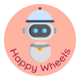
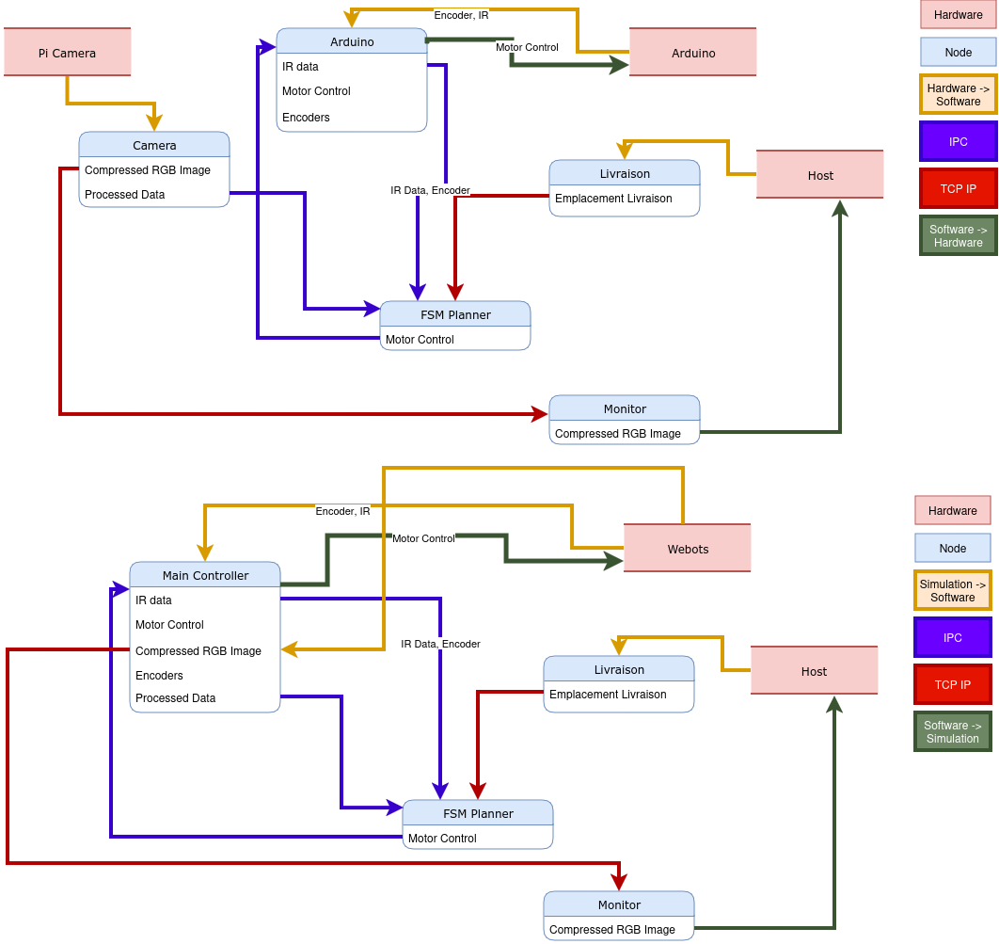

# HappyWheels

HappyWheels est le nom de notre équipe pour ce projet au sein de la ST5 Véhicules Intelligents. Nous avons choisi ce nom car il est en lien avec le thème du projet,
qui est la simulation de véhicules dans un scénario que nous avons défini comme étant de la livraison de plats dans un restaurant.

<center></center>

## Membres de l'équipe

- [Jiaheng DONG]()
- [Tom KIRCHGESSNER]()
- [François LE FEBVRE DE NAILLY]()
- [Dahwa LE GRAND]()
- [Enzo Le Van](https://github.com/Hennzau)
- [Sophie SCHAFFNIT]()


## Objectifs

Nous nous sommes fixé comme objectif de proposer une solution end-to-end à la fois pour la simulation du véhicule et pour le contrôle du robot réel.

Les objectifs étaient :
- Simple à utiliser, c'est à dire une architecture modulaire et facilement extensible
- Robuste, c'est à dire capable de gérer des erreurs et des situations imprévues, chaque processus devant être capable de ne pas bloquer les autres
- Remote, c'est à dire capable de fonctionner à distance, pour pouvoir tester le robot réel à distance et de pouvoir lancer chaque processus sur des machines différentes
- Performant, c'est à dire capable de fonctionner en temps réel, pour pouvoir être utilisé dans un environnement réel

## Architecture

Entre la simulation et le robot réel, seulement deux noeuds changent. Le reste de l'architecture est identique.

- Pour le robot réel, nous devons lancer deux noeuds spécifiques au robot : `nodes/camera.py` et `nodes/arduino.py`
- Pour la simulation, nous devons sélectionner le noeud `simulation/controllers/main/main.py` comme controller dans Webots.

Les autres noeuds peuvent ensuite être lancés en fonction de l'objectif de l'expérience.



## Features

Le robot est capable de capturer le flux vidéo de la caméra afin de suivre une ligne. Il est aussi capable de se repérer dans un quadrillage avec
un itinéraire dynamique en fonctions d'obstacles perçus par le capteur infrarouge.

Pour lancer le robot, vous devez avoir un accès `ssh` au robot, c'est mieux par Wifi. Il faut ensuite accéder au repository `happywheels` (e.g `cd Documents/st5-robot`).
Puis il faut :

- Dans un terminal, lancer la caméra : `python nodes/camera.py`
- Dans un autre terminal, lancer le contrôle de l'arduino : `python nodes/arduino.py`
- Dans un troisième terminal, lancer le contrôle du robot : `python nodes/planner.py`

Vous pouvez ensuite monitorer et faire naviguer le robot en lançant deux autres noeuds sur votre ordinateur à vous :

- Dans un terminal, lancer le moniteur de contrôle : `python nodes/dev-monitoring.py`
- Dans un terminal, lancez le navigateur : `python nodes/client-monitor.py`

## Dépendances

Ce robot est fait pour fonctionner avec python 3.9 sur la raspberry et sur votre ordinateur. Les dépendences sont :

- `numpy`
- `opencv-python`
- `eclipse-zenoh`
- `pycdr2`
- `picamera`
- `dearpygui` (sur le Host seulement)
- `pyqt6` (sur le Host seulement)

**Note**: Le code qui doit être flashé sur l'arduino est dans le dossier `arduino/arduino.ino`.

## IPC / TCP-IP

Les différents noeuds ont été créés avec la bibliothèque `zenoh` qui permet de connecter des processus entre eux en utlisant des protocoles de communication
comme TCP, UDP, Serial, etc. Cela permet de lancer les noeuds sur des machines différentes et de les connecter ensemble.

L'idée est de modifier les fichiers `host_zenoh.json` et `rpi_zenoh.json` pour mettre les IP des machines sur lesquelles vous voulez lancer les noeuds.

Par exemple, dans le cas où vous avez un ordinateur "programmation" (utilisé par les gérants du restaurant), une machine "client" (utilisée pour l'interface graphique), ainsi qu'une raspberry **sur le même réseau WiFi** :

- Obtenez l'IP de votre ordinateur "programmation", (e.g `169.254.74.150`)
- Obtenez l'IP de l'ordinateur "client", (eg. `172.20.10.2:7447`)
- Obtenez l'IP de votre raspberry, (e.g `169.254.74.151`)

Modifiez les fichiers `host_zenoh.json` et `rpi_zenoh.json` pour mettre les bonnes IP :

```json
// host_zenoh.json
{
  "mode": "peer",
  "connect": {
    "endpoints": [
      "udp/localhost:7447",
      "udp/169.254.74.151:7447",
      "udp/172.20.10.2:7447",
    ]
  },
  "listen": {
    "endpoints": ["udp/0.0.0.0:0"]
  },
  "scouting": {
    "multicast": {
      "enabled": true
    }
  }
}

// rpi_zenoh.json
{
  "mode": "peer",
  "connect": {
    "endpoints": [
      "udp/localhost:7447",
      "udp/169.254.74.150:7447",
      "udp/172.20.10.2:7447",
    ]
  },
  "listen": {
    "endpoints": ["udp/0.0.0.0:0"]
  },
  "scouting": {
    "multicast": {
      "enabled": true
    }
  }
}
```
